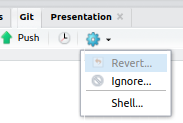

GitHub
========================================================
author: Kevin Shook and Rob Chlumsky
date:
autosize: true

Outline
========================================================
- Version control
- What are git and GitHub?
- How to set up
- Using git in R
- Working with GitHub

Version control programs
========================================================
- When you create R files (code, notebooks, documents), there
are always changes
- Changes often damage the files
  - need to go back to older versions
- Need to add new features without damaging current version
- Especially true when working with other people
- Version control programs allow you to manage the versions
of the files that you create.


git
========================================================
- Most popular version control program
- Written by Linus Torvalds, creator of Linux
- Free Open Source Software (FOSS)
- *Distributed* version control
  - doesn't require a centralised server like SVN

GitHub
========================================================
- Website running git
- Allows you to backup your git repository
- Also allows collaboration with others
- There are other similar sites like GitLab: https://about.gitlab.com/

Getting git
========================================================
- Built into Linux
- For MacOS or Windows, you can download git from https://git-scm.com/

How git works
=======================================================
- A folder called **.git** is created in the directory holding
your your project, the working directory
- This is the repository
  - It contains all old versions of your files
- When you make changes to the files, you add them to the repository
- You can retrieve old versions of the files into the working
directory

git and Rstudio
=======================================================
- When you clone a repository from GitHub, a local repository
is automatically created
- You can also set up git for a local project under
Tools | Project Options ...

Working with git
=======================================================
- git is a command-based program
- There are many GUIs for git, including Rstudio
  - makes working with git much easier
  - uses Git tab in top-right  
  
  - you will still have to type commands occasionally

Typing in commands
=======================================================
- In Linux or Mac OS, you can type in git commands in any terminal, including
the terminal tab in Rstudio  
  
- In Windows, you have to use the git shell, which is accessed through a 
drop-down menu  



Configuring git
========================================================
- The first step is to tell git who you are:

```
$ git config --global user.name "John Doe"
$ git config --global user.email johndoe@example.com
```

You can list your current settings with the command

```
$ git config --list
```

ssh
=======================================================
- ssh is short for "secure shell"
- provides secure, encrypted communication between 2 computers
- if you set it up on your computer, you can avoid having to
type in your user name and password every time
- part of Linux and Mac OS
- to add to Windows
https://jcutrer.com/windows/install-openssh-on-windows10


